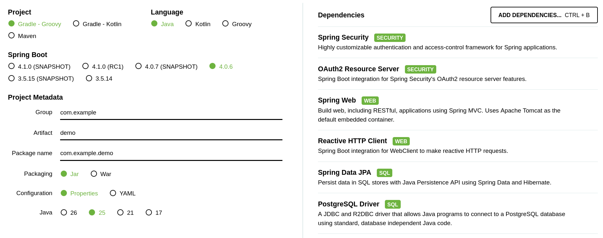

<!--
- Create Spring Boot backend
- Create Angular frontend
- Deploy Keycloak
- Configure self-registration
- Add EDDIE Connect button component
-->

# Day 5 — Application Skeleton

**Goal**:

- Create a minimal backend protected by Keycloak
- Create a minimal frontend that signs users in with `keycloak-js`
- Embed the EDDIE Connect button in the frontend

**Estimated time**: 2 hours

[Download starting code](https://github.com/eddie-energy/tutorial/archive/refs/heads/day-04.zip)

## Step 1 — Set up Keycloak for authentication

First, we will add a Keycloak instance to handle all our authentication needs.

```yaml [docker-compose.yml]
keycloak:
  image: quay.io/keycloak/keycloak:26.6.0
  ports:
    - "8888:8080"
  environment:
    KC_BOOTSTRAP_ADMIN_USERNAME: admin
    KC_BOOTSTRAP_ADMIN_PASSWORD: admin
  volumes:
    - ./keycloak.json:/opt/keycloak/data/import/realm.json:ro
  command: start-dev --import-realm
```

To avoid manual configuration via the Keycloak UI, we will create a realm import file and mount it into the container.
Before starting the Keycloak container, create `keycloak.json`.

```json [keycloak.json]
{
  "realm": "tutorial-realm",
  "enabled": true,
  "registrationAllowed": true,
  "clients": [
    {
      "clientId": "tutorial-client",
      "enabled": true,
      "redirectUris": [
        "http://localhost:4200/*"
      ],
      "webOrigins": [
        "http://localhost:4200"
      ],
      "publicClient": true
    }
  ],
  "users": [
    {
      "username": "eddie",
      "email": "eddie@eddie.local",
      "firstName": "Eddie",
      "lastName": "Eddington",
      "enabled": true,
      "credentials": [
        {
          "type": "password",
          "value": "eddie"
        }
      ]
    }
  ]
}
```

You can now start the Keycloak container with the following command:

```shell
docker compose start keycloak
```

Open http://localhost:8888/admin/master/console/#/tutorial-realm and log in with admin/admin to verify the realm was imported correctly.
Our imported realm also includes a test user `eddie` with password `eddie` that you can use to log in from the frontend later.

## Step 2 — Create the Spring backend

We will be using the Spring Initializr at https://start.spring.io/.



Extract the downloaded archive into the `backend` directory.

TODO: Check if we should just upload the zip to the repo to avoid the manual step.

We use Spring Boot as an OAuth2 resource server.
The backend only exposes one protected endpoint so you can verify authentication end-to-end.
We will also set the backend port to `8082` to avoid clashing with EDDIE on `8080` or later AIIDA on `8081`.

```properties [backend/src/main/resources/application.properties]
server.port=8082
spring.security.oauth2.resourceserver.jwt.issuer-uri=http://localhost:8888/realms/tutorial-realm
```

Next we add a minimal security configuration to enable JWT authentication with Keycloak.

```java [backend/src/main/java/energy/eddie/tutorial/backend/SecurityConfig.java]
package energy.eddie.tutorial.backend;

@Configuration
class SecurityConfig {

    @Bean
    SecurityFilterChain securityFilterChain(HttpSecurity http) {
        return http
                .cors(Customizer.withDefaults())
                .csrf(CsrfConfigurer::spa)
                .authorizeHttpRequests(auth -> auth.anyRequest().authenticated())
                .oauth2ResourceServer(oauth2 -> oauth2.jwt(Customizer.withDefaults()))
                .build();
    }
}
```

We will add one protected endpoint to verify that authentication works correctly.

```java [backend/src/main/java/energy/eddie/tutorial/backend/UserController.java]
package energy.eddie.tutorial.backend;

@RestController
@CrossOrigin(origins = "http://localhost:4200")
class UserController {

    @GetMapping("/api/me")
    Map<String, String> me(@AuthenticationPrincipal Jwt jwt) {
        return Map.of("name", jwt.getClaimAsString("name"));
    }
}
```

To prepare for the following days, we will also add a database connection to our backend.
We will reuse the PostgreSQL instance from the EDDIE stack and connect to it with Spring Data JPA.
We will however create a new database and user to avoid any accidental interference with EDDIE's data.

Create a new `db.sql` file with the following content.

```sql [db.sql]
CREATE USER tutorial WITH ENCRYPTED PASSWORD 'tutorial';
CREATE DATABASE tutorial OWNER tutorial;
```

In our `docker-compose.yml` we will mount this file into the PostgreSQL container so it is executed on startup and creates the required database and user.
We will also expose the PostgreSQL port so our backend can connect to it.

```yaml [docker-compose.yml]
  db:
    ports:
      - "5432:5432"
    volumes:
      - ./db.sql:/docker-entrypoint-initdb.d/db.sql:ro
```

Finally, we will add the database connection configuration to our Spring Boot application.
In a production application, you would want to use environment variables for the database credentials instead of hardcoding them in the properties file.
We are also setting `spring.jpa.hibernate.ddl-auto=update` for simplicity, but in a production application you would want to manage your database schema with proper migrations.

```properties [backend/src/main/resources/application.properties]
spring.datasource.url=jdbc:postgresql://localhost:5432/tutorial
spring.datasource.username=tutorial
spring.datasource.password=tutorial
spring.jpa.hibernate.ddl-auto=update
```

You should now be able to run the backend with the following command:

```shell
cd backend
./gradlew bootRun
```

## Step 3 — Create the Angular frontend

Next we use the Angular CLI to generate the frontend project.
We will use the default configuration and skip tests to keep things simple.

```shell
npx @angular/cli new frontend --defaults --skip-tests
```

Verify it runs before making any changes.

```shell
cd frontend
npm start
```

## Step 4 — Configure Angular with Keycloak

Keycloak maintains the [keycloak-js](https://github.com/keycloak/keycloak-js) package to simplify integration.
This package works well with Angular and any other frontend framework.

```shell
npm install keycloak-js
```

We will simply initialize Keycloak before bootstrapping the Angular application in `main.ts`.
For now, we will just direct all unauthenticated users to the Keycloak login page on app load.

```typescript [frontend/src/main.ts]
import Keycloak from 'keycloak-js';

export const keycloak = new Keycloak({
    url: 'http://localhost:8888',
    realm: 'tutorial-realm',
    clientId: 'tutorial-client',
});

keycloak
    .init({onLoad: 'login-required'})
    .then(() => bootstrapApplication(App, appConfig))
    .catch((err) => console.error(err));
```

Next we will just slightly adapt the `app.ts` file to show the current user.

```typescript [frontend/src/app/app.ts]
import { Component, OnInit, signal } from '@angular/core';
import { RouterOutlet } from '@angular/router';
import { keycloak } from '../main';

@Component({
    selector: 'app-root',
    imports: [RouterOutlet],
    templateUrl: './app.html',
    styleUrl: './app.css',
})
export class App implements OnInit {
    name = signal('stranger');

    ngOnInit() {
        fetch('http://localhost:8082/api/me', {
            headers: {
                Authorization: `Bearer ${keycloak.token}`,
            },
        })
            .then((response) => response.json())
            .then((data) => this.title.set(data.name))
            .catch((err) => console.error(err));
    }
}
```

We will take this opportunity to remove the default Angular content from
`app.html` and replace it with a simple welcome message.

```html [frontend/src/app/app.html]
<h1>Hello, {{ name() }}!</h1>
```

When visiting http://localhost:4200 you should now be redirected to the Keycloak login page.
There you can register a new user and log in.
You should be directed back to the Angular app and see your provided name.
Watch out for console errors in case something is not working.

## Step 5 — Add the EDDIE Connect button

To load the EDDIE button web component, simply add the following line to your head in `frontend/src/index.html`:

```html [frontend/src/index.html]
<script src="http://localhost:8080/lib/eddie-components.js" type="module"></script>
```

Then in your `app.html` you can add the EDDIE button component:

```html [frontend/src/app/app.html]
<eddie-connect-button connection-id="1" data-need-id="00000000-0000-0000-0000-000000000001"></eddie-connect-button>
```

Run the frontend:

```shell
npm start
```

## Checkpoint

- [ ] You can register a user via Keycloak and sign in from the Angular app
- [ ] Upon signing in, the Angular app shows your username fetched from the backend
- [ ] The EDDIE Connect button is visible in your Angular UI

## What's next

On day 6 you will customise the EDDIE button and map received data to a concrete user flow.

[Download the result of the day](https://github.com/eddie-energy/tutorial/archive/refs/heads/day-05.zip)

