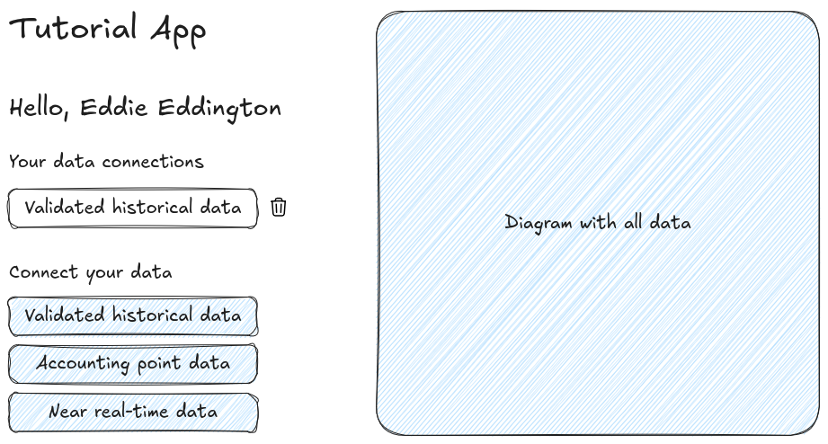

<!--
- Implement onboarding redirect
- Request:
    - Accounting point master data
    - Validated historical data
- Confirm that connection ID appears in outbound messages
- Map connection ID to user
- Customise EDDIE button text, icon, and colors:
  https://architecture.eddie.energy/framework/1-running/eddie-button/eddie-button.html#customize-colors-and-content
-->

# Day 6 — User-Bound Connections

**Goal**:

- Generate connection IDs and map them to users when they create a permission via the EDDIE button
- Generate data and trace it in the outbound connectors via its connection ID

**Estimated time**: 1 hour

[Download starting code](https://github.com/eddie-energy/tutorial/archive/refs/heads/day-05.zip)

## Step 1 — Define our user flow

Before we start coding, let us define the user flow for what we will build.
Our app will allow users to connect data from a predefined set of data needs.
For each data need we will render an EDDIE button and use our user id as the connection id.

When the user clicks a button and follows the step to connect their data,
connection status messages will be generated on creation and for status updates.
Our backend will use these messages to save user connections to our database.

In the following days we will use also the connection information to filter incoming data per user and permission to show it in a diagram.



## Step 2 — Model user connections in the backend

Now that we know how the user will interact with connections, we can model an entity for our backend.
We will follow a typical repository pattern of model, repository, service, and controller.
In the backend folder, create a new file `UserConnection.java`:

```java [UserConnection.java]

@Entity
class UserConnection {

    @Id
    @GeneratedValue(strategy = GenerationType.UUID)
    private String id;

    @Column(nullable = false)
    private String userId;

    @Column(nullable = false, unique = true)
    private String permissionId;

    @Column(nullable = false)
    private String dataNeedId;

    @Column(nullable = false)
    private String status;

    protected UserConnection() {
    }

    public UserConnection(String userId, String permissionId, String dataNeedId, String status) {
        this.userId = userId;
        this.permissionId = permissionId;
        this.dataNeedId = dataNeedId;
        this.status = status;
    }

    public String getId() {
        return id;
    }

    public String getUserId() {
        return userId;
    }

    public String getPermissionId() {
        return permissionId;
    }

    public String getDataNeedId() {
        return dataNeedId;
    }

    public String getStatus() {
        return status;
    }
}
```

Next we add a Spring repository to retrieve connections per user in `UserConnectionRepository.java`.
We also add a method to find an existing permission so we can update its status.

```java [UserConnectionRepository.java]
interface UserConnectionRepository extends JpaRepository<UserConnection, String> {
    List<UserConnection> findAllByUserId(String userId);

    Optional<UserConnection> findByPermissionId(String permissionId);
}
```

<!-- TODO: Inline the rest client logic into the service? -->

Before we add our service, we will handle the retrieval of status messages.
We previously used the REST endpoints of the EDDIE framework to retrieve all status messages.
However, these endpoints can also provide data in real-time via server-sent events.

We will encapsulate this logic in a new class `EddieRestClient.java`.
Spring's [WebClient](https://docs.spring.io/spring-framework/reference/web/webflux-webclient.html) that we added on the previous day has built-in support for server-sent event streams.

```java [EddieRestClient.java]

@Component
public class EddieRestClient {

    private static final Logger LOGGER = LoggerFactory.getLogger(EddieRestClient.class);

    private final WebClient client = WebClient.create("http://localhost:9090/outbound-connectors/rest");

    public void connectionStatusMessages(Consumer<ConnectionStatusMessage> consumer) {
        client.get().uri("/agnostic/connection-status-messages")
                .accept(MediaType.TEXT_EVENT_STREAM)
                .retrieve()
                .bodyToFlux(ConnectionStatusMessage.class)
                .doOnError(error -> LOGGER.error("Error while retrieving connection status messages", error))
                .retry()
                .subscribe(consumer);
    }
}
```

Next we create the service layer as `UserConnectionService.java`.
In this service we inject our repository and the EDDIE client.
An init method runs after dependency injection to handle incoming status messages.
If a connection with the given permission id already exists we instead update its status.

```java [UserConnectionService.java]

@Service
class UserConnectionService {
    private final UserConnectionRepository repository;
    private final EddieRestClient eddie;

    UserConnectionService(UserConnectionRepository repository, EddieRestClient eddie) {
        this.repository = repository;
        this.eddie = eddie;
    }

    @PostConstruct
    void init() {
        eddie.connectionStatusMessages(message -> {
            var userConnection = repository
                    .findByPermissionId(message.permissionId())
                    .orElse(new UserConnection(
                            message.connectionId(),
                            message.permissionId(),
                            message.dataNeedId(),
                            message.status()));
            repository.save(userConnection);
        });
    }

    List<UserConnection> findAllByUserId(String userId) {
        return repository.findAllByUserId(userId);
    }
}
```

Finally, we will update our `UserController.java` to include an endpoint for retrieving connections.
Note that we also adapt the `/api/me` endpoint to include the user id.
We will use this user id as our connection id on the EDDIE button.

```java [UserController.java]

@RestController
@CrossOrigin(origins = "http://localhost:4200")
class UserController {

    private final UserConnectionService userConnectionService;

    UserController(UserConnectionService userConnectionService) {
        this.userConnectionService = userConnectionService;
    }

    @GetMapping("/api/me")
    Map<String, String> me(@AuthenticationPrincipal Jwt jwt) {
        return Map.of("id", jwt.getSubject(), "name", jwt.getClaimAsString("name"));
    }

    @GetMapping("/api/connections")
    List<UserConnection> connections(@AuthenticationPrincipal Jwt jwt) {
        return userConnectionService.findAllByUserId(jwt.getSubject());
    }
}
```

## Step 3 — Rendering buttons and making connections

On the frontend, we will retrieve user connections to display and render EDDIE buttons for our data needs.
In our `app.ts` file, add a new function to fetch existing connections.
We will also update our user details query to also set the user id.

```js [app.ts]

@Component({
    selector: 'app-root',
    imports: [RouterOutlet],
    schemas: [CUSTOM_ELEMENTS_SCHEMA],
    templateUrl: './app.html',
    styleUrl: './app.css',
})
export class App implements OnInit {
    name = signal('stranger');
    userId = signal('');
    connections = signal < {id: string; permissionId: string; status: string}[] > ([]);

    ngOnInit() {
        fetch('http://localhost:8082/api/me', {
            headers: {
                Authorization: `Bearer ${keycloak.token}`,
            },
        })
            .then((response) => response.json())
            .then((data) => {
                this.name.set(data.name);
                this.userId.set(data.id);

                void this.updateConnections();
            })
            .catch((err) => console.error(err));
    }

    async updateConnections() {
        const response = await fetch('http://localhost:8082/api/connections', {
            headers: {
                Authorization: `Bearer ${keycloak.token}`,
            },
        });

        const data = await response.json();

        this.connections.set(data);
    }
}
```

Next we update our `app.html` to show our connections and our two buttons:

```html [app.html]
<h1>Tutorial App</h1>

<h2>Hello, {{ name() }}!</h2>

<h3>Your connections</h3>

@if (connections().length > 0) {
<ul>
    @for (connection of connections(); track connection.id) {
    <li>
        <i>{{ connection.permissionId }}</i>
        <br/>
        <span>{{ connection.status }}</span>
    </li>
    }
</ul>
} @else {
<p>You have no connections yet.</p>
}

<h3>Connect your data</h3>

<eddie-connect-button
        [attr.connection-id]="userId()"
        data-need-id="00000000-0000-0000-0000-000000000001"
></eddie-connect-button>
<br/>
<eddie-connect-button
        [attr.connection-id]="userId()"
        data-need-id="00000000-0000-0000-0000-000000000002"
></eddie-connect-button>
```

## Step 4 — Trace connection ID in outbound messages

TODO

## Step 5 — Customise the EDDIE button

TODO

## Checkpoint

- [ ] Frontend renders EDDIE buttons for historical data and accounting point data
- [ ] Buttons are configured with a data need and the user id as its connection id
- [ ] Previously added connections are visible on the frontend
- [ ] Existing connections will update their status

## What's next

On day 7 you will start persisting inbound data and linking it to your users.

[Download the result of the day](https://github.com/eddie-energy/tutorial/archive/refs/heads/day-06.zip)