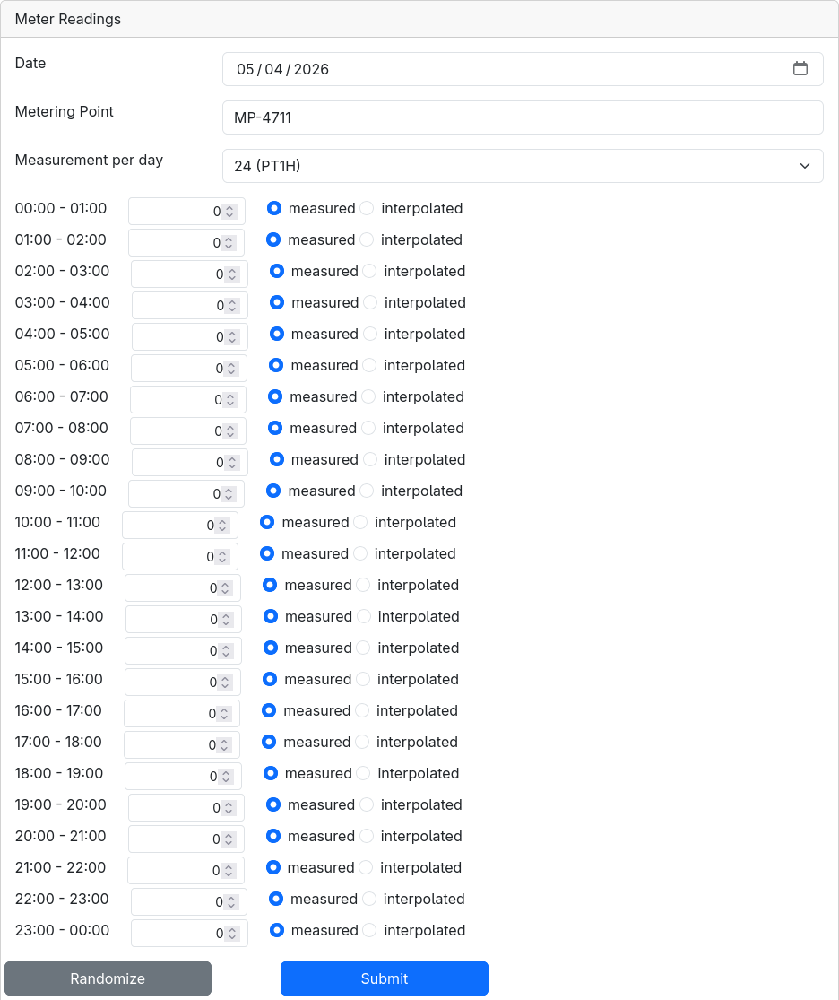

<!--
Goal: Understand incoming data variability
Activities:
- Store processed data and link with user account
- Analyse and develop an understanding for raw payloads (and note towards CIM)
- Compare formats across connectors (France and Austria without need to follow along)
- Explore metadata diversity (what metadata?)
- Understand log information (??)

TODO:
- Implement accounting point data for the simulation connector so we can store it as well.
-->

### Day 7 — Persistence & Raw Data Exploration

**Goal**:

- First goal
- Second goal

**Estimated time**: 2h

[Download starting code](https://github.com/eddie-energy/tutorial/archive/refs/heads/day-06.zip)

## Step 1 — Exploring raw data

On [day 6](day-06.md) we listened to connection status messages published by EDDIE to persist connections per user.
Today we will use a similar approach to also persist incoming data messages.

To enable raw data output, you first need to add the following line to your `.env` file.

```dotenv [.env]
EDDIE_RAW_DATA_OUTPUT_ENABLED=true
```

Then recreate the EDDIE container:

```shell
docker compose down eddie
docker compose up -d eddie
```

Once the container has started we will generate some more by navigating to the demo page at http://localhost:8080/demo.
Click the EDDIE button, select the simulation connector, and click **Launch Simulation**.
You will see a set of fields labelled **Meter Readings** where you can generate some random data.
Click **Submit** to generate a first batch.



With our test data generated we should now be able to retrieve it as raw data via our REST outbound connector.

```shell
curl http://localhost:9090/outbound-connectors/rest/agnostic/raw-data-messages | jq
```

You should see a list of messages consisting of a metadata header and a raw data payload.
The metadata structure will be the same for all region connectors.
The structure of the raw data payload will match the data received from the metered data administrator.

```json
{
  "messages": [
    {
      "permissionId": "pm::9bd0668f-cc19-40a8-99db-dc2cb2802b17::1",
      "connectionId": "1",
      "dataNeedId": "9bd0668f-cc19-40a8-99db-dc2cb2802b17",
      "dataSourceInformation": {
        "countryCode": "DE",
        "meteredDataAdministratorId": "sim",
        "permissionAdministratorId": "sim",
        "regionConnectorId": "sim"
      },
      "timestamp": "2026-04-30T11:32:56.174011647Z",
      "rawPayload": "..."
    }
  ]
}
```

Let's inspect the payload produced by our simulation connector.

```shell
curl http://localhost:9090/outbound-connectors/rest/agnostic/raw-data-messages | jq ".messages[].rawPayload | fromjson"
```

You can see that it again include some metadata and all the fields that we were able to set in the UI.

```json
{
  "connectionId": "1",
  "dataNeedId": "9bd0668f-cc19-40a8-99db-dc2cb2802b17",
  "permissionId": "pm::9bd0668f-cc19-40a8-99db-dc2cb2802b17::1",
  "meteringPoint": "MP-4711",
  "startDateTime": "2026-04-29T22:00:00.000Z",
  "meteringInterval": "PT1H",
  "measurements": [
    {
      "value": 41.0,
      "measurementType": "MEASURED"
    },
    ...
  ]
}
```

<!-- TODO: Example for Spain/France/Austria to compare against -->

On day 10, we will learn about a standardised format for metered data payloads that works across all region connectors.

## Step 2 — Persisting raw data

Based on the data we received we can create a data transfer object inside `RawDataMessage.java`.

```java
public record RawDataMessage(
        String connectionId,
        String permissionId,
        String dataNeedId,
        String status,
        DataSourceInformation dataSourceInformation,
        ZonedDateTime timestamp,
        String rawPayload
) {
    public record DataSourceInformation(
            String countryCode,
            String regionConnectorId,
            String meteredDataAdministratorId,
            String permissionAdministratorId) {
    }
}
```

We will also create a separate record in `SimulationMeterReading.java` to map the raw data payload to the format of the simulation connector.

```java [SimulationMeterReading.java]
public record SimulationMeterReading(
        ZonedDateTime startDateTime,
        String meteringInterval,
        List<SimulationMeasurement> measurements
) {
    public record SimulationMeasurement(
            Double value
    ) {
    }
}
```

Now to consume incoming raw data messages we can use the same approach we used to collect the status messages.
Inside the `EddieRestClient`, you can copy the `connectionStatusMessages` method and transform it for raw data.

```java [EddieRestClient.java]
    public void rawDataMessages(Consumer<RawDataMessage> consumer) {
        client.get().uri("/agnostic/raw-data-messages")
                .accept(MediaType.TEXT_EVENT_STREAM)
                .retrieve()
                .bodyToFlux(RawDataMessage.class)
                .doOnError(error -> LOGGER.error("Error while retrieving raw data messages", error))
                .retryWhen(Retry.backoff(Long.MAX_VALUE, Duration.ofSeconds(5)))
                .subscribe(consumer);
    }
```

Next we need an entity to persist the incoming data.
On [day 12](day-12.md) we want to visualise our energy consumption in a line chart.
Each connection should be visible as a line of consumption record as data points.
Data points need to reference a user and permission by id, 
and they need to include the timestamp of the meter reading with its value. 
We will assume that all data arrives in the same unit of measurement.
To keep our rows even smaller and to avoid duplicate entries per timestamp, 
we will use the timestamp and permission id as a composite primary key.

From these requirements we can now create our entity inside a new `MeterReading.java` file.
By adding getters for the permission id, timestamp, and quantity, we can reuse the same class for the controller.

```java [MeterReading.java]
@Entity
class MeterReading {

    @EmbeddedId
    private Id id;
    @Column(nullable = false)
    private String userId;
    @Column(nullable = false)
    private BigDecimal quantity;

    protected MeterReading() {
    }

    public MeterReading(String userId, String permissionId, Instant timestamp, BigDecimal quantity) {
        this.id = new Id(permissionId, timestamp);
        this.userId = userId;
        this.quantity = quantity;
    }

    @Embeddable
    record Id(
            String permissionId,
            Instant timestamp
    ) {
    }

    public String getPermissionId() {
        return id.permissionId;
    }

    public Instant getTimestamp() {
        return id.timestamp;
    }

    public BigDecimal getQuantity() {
        return quantity;
    }
}
```

For persisting the data points create a new repository in `MeterReadingRepository.java`.

```java [MeterReadingRepository.java]
interface MeterReadingRepository extends JpaRepository<MeterReading, MeterReading.Id> {}
```

We will keep the body empty for now and implement the data access in the next step.
To complete the persisting logic, we add a new service `MeterReadingService` similar to our `UserConnectionService`.
The service again injects its repository and the EDDIE client.
To map the raw data payload to `SimulationMeterReading` objects we also inject an object mapper.
We will also add a logger to warn if we fail to process an incoming message.

```java [MeterReadingService.java]
@Service
class MeterReadingService {

    private static final Logger LOGGER = LoggerFactory.getLogger(MeterReadingService.class);

    private final MeterReadingRepository repository;
    private final EddieRestClient eddie;
    private final ObjectMapper objectMapper;

    MeterReadingService(MeterReadingRepository repository, EddieRestClient eddie, ObjectMapper objectMapper) {
        this.repository = repository;
        this.eddie = eddie;
        this.objectMapper = objectMapper;
    }
}
```

Like our `UserConnectionService`, the `MeterReadingService` implements a `@PostConstruct` method.
This method calls the client's `rawDataMessages` method to handle incoming `RawDataMessage` objects.

<!-- TODO: Split into multiple steps with more detail and provide final file contents -->

```java [MeterReadingService.java]
@PostConstruct
void init() {
    eddie.rawDataMessages(message -> {
        if (message.dataSourceInformation().regionConnectorId().equals("sim")) {
            try {
                var simulationReading = objectMapper.readValue(message.rawPayload(), SimulationMeterReading.class);
                var interval = Duration.parse(simulationReading.meteringInterval());

                var meterReadings = new ArrayList<MeterReading>();

                var step = 1;
                for (var measurement : simulationReading.measurements()) {
                    var timestamp = simulationReading
                            .startDateTime()
                            .plus(interval.multipliedBy(step++));

                    meterReadings.add(new MeterReading(
                            message.connectionId(),
                            message.permissionId(),
                            timestamp.toInstant(),
                            BigDecimal.valueOf(measurement.value())));
                }

                repository.saveAll(meterReadings);
            } catch (JacksonException e) {
                LOGGER.warn("Failed to read simulation meter reading.", e);
            }
        }
    });
}
```

Now if we restart our backend, we can again navigate to our simulation connector via the EDDIE button and generate some more data.
If everything worked, the values generated should end up in your database.

## Step 3 — Show the latest reading on the frontend

<!-- TODO: Display readings per permission on click instead? -->

As mentioned earlier, we eventually want to visualise the energy consumption of a user in a diagram.
However, processing time series data for this purpose efficiently can be troublesome.
So instead we will end with showing just the latest reading per connection for now.

In our `MeterReadingRepository` add the following query method:

```java [MeterReadingRepository.java]
@Query(value = """
    SELECT DISTINCT ON (permission_id) *
    FROM meter_reading
    WHERE user_id = :userId
    ORDER BY permission_id, timestamp DESC;
    """, nativeQuery = true)
List<MeterReading> findLatestPerPermission(@Param("userId") String userId);
```

The query uses a native PostgreSQL query to 
1. filter rows by the given user id
2. order rows by permission id and timestamp
3. select only the first item per permission id

This effectively results in a list of the latest meter reading per permission.

Inside our `MeterReadingService` we add a simple delegating method of the same signature.

```java [MeterReadingService.java]
List<MeterReading> findLatestPerPermission(String userId) {
    return repository.findLatestPerPermission(userId);
}
```

Next we create a new controller in `MeterReadingController.java`.
You can pretty much copy the `UserConnectionController` replacing `UserConnection` with `MeterReading`.

```java [MeterReadingController.java]
@RestController
@CrossOrigin(origins = "http://localhost:4200")
class MeterReadingController {

    private final MeterReadingService meterReadingService;

    MeterReadingController(MeterReadingService meterReadingService) {
        this.meterReadingService = meterReadingService;
    }

    @GetMapping("/api/readings/latest")
    List<MeterReading> latest(@AuthenticationPrincipal Jwt jwt) {
        return meterReadingService.findLatestPerPermission(jwt.getSubject());
    }
}
```

<!-- TODO: Separate TS (service) file for metered data? -->

In our `app.ts` file we add a new method `updateLatestReading` to read the endpoint into a signal `latestReading`.
This signal holds a mapping of permission id to a description string.

```ts [app.ts]
export class App implements OnInit {
    latestReadings = signal<Map<string, string>>(new Map());

    ngOnInit() {
        // ...
        void this.updateLatestReadings();
    }

    async updateLatestReadings() {
        const response = await fetch('http://localhost:8082/api/readings/latest', {
            headers: {
                Authorization: `Bearer ${keycloak.token}`,
            },
        });

        const readings = await response.json();
        const mapped = new Map();

        for (const { permissionId, quantity, timestamp } of readings) {
            mapped.set(
                permissionId,
                `Latest reading on ${new Date(timestamp).toLocaleString()}: ${quantity} Wh`,
            );
        }

        this.latestReadings.set(mapped);
    }
}
```

Inside the `app.html` we add a new line to our connection entries reading the description for that permission.
If no entry is found, the span will just be blank.

```html
@for (connection of connections(); track connection.id) {
<li>
    <i>{{ connection.permissionId }}</i>
    <br />
    <span>{{ connection.status }}</span>
    <br />
    <span>{{ latestReadings().get(connection.permissionId) }}</span>
</li>
}
```

Now if you reload your page, you should see an entry like this for the data you generated previously.

```
- 7ea9b598-1d28-456d-af3a-88f2d9b147f4
  FULFILLED
  Latest reading on 5/7/2026, 12:00:00 AM: 49 Wh
```

## Checkpoint

- You understand the concept of raw data
- Metered data readings generated from the simulation connector are saved to the database
- The time of the latest reading is visible on the frontend

## What's next

On day 8 we will explore how to request future data that is not yet available, 
how to detect gaps in your time series data,
and how to request the retransmission of missing data.

[Download the result of the day](https://github.com/eddie-energy/tutorial/archive/refs/heads/day-07.zip)
