# Day 9 — Observability & Logging

**Goals**

- Configure and start OpenTelemetry services
- Configure OpenTelemetry in EDDIE


**Estimated time**: 5 hours

## Prerequisites

- `docker-compose.yml` from previous days
- `.env` from previous days

## Step 1 - Configure and start OpenTelemetry services

OpenTelemetry is a standard for observability that helps users gain insights into their applications.
OpenTelemetry Collectors collect logs, metrics, and traces from applications.
The collector can then export these for further processing to other services.
We are going to use [Grafana's LGTM Docker image](https://grafana.com/docs/opentelemetry/docker-lgtm/), which bundles and preconfigures the OpenTelemetry Collector, [Loki](https://grafana.com/oss/loki/) for logs, [Mimir](https://grafana.com/oss/mimir/) for metrics, [Tempo](https://grafana.com/oss/tempo/) for traces, and [Grafana](https://grafana.com/oss/grafana/) for dashboards and alerting.
This allows us to quickly deploy an OpenTelemetry stack with minimal configuration.
Extend the Docker Compose configuration from the previous days with the following service.

```yml [docker-compose.yml]
services:
  # ... other services
  lgtm:
    image: grafana/otel-lgtm:latest
    ports:
      - "3000:3000"
```

As you can see, there is barely any configuration necessary - only the port forwarding for Grafana so we can access the dashboards in the browser.
Start the service using:

```sh 
docker compose up -d lgtm
```

# Step 2 - Configure OpenTelemetry in EDDIE

We now need to configure EDDIE to export logs, metrics, and traces to the OpenTelemetry collector.
This is also rather simple:

```sh [.env]
OTEL_SDK_DISABLED=false
OTEL_RESOURCE_ATTRIBUTES_DEPLOYMENT_ENVIRONMENT=dev
OTEL_RESOURCE_ATTRIBUTES_SERVICE_NAME=EDDIE
OTEL_RESOURCE_ATTRIBUTES_SERVICE_NAMESPACE=eddie.energy
OTEL_EXPORTER_OTLP_ENDPOINT=http://lgtm:4318
OTEL_EXPORTER_OTLP_PROTOCOL=http/protobuf
LOGGING_STRUCTURED_FORMAT_CONSOLE=ecs
```

This configuration sets the OpenTelemetry collector endpoint and defines several resource attributes that you can customize as needed.
Lastly, it sets the structured logging format to Elastic Common Schema (ECS), which is a widely used structured logging format.
For more format options, see the [Spring Docs](https://docs.spring.io/spring-boot/reference/features/logging.html#features.logging.structured). 

Now it is possible to start EDDIE, and it should begin sending observability data to the OpenTelemetry collector:

```sh 
docker compose up -d eddie
```

Open Grafana at http://localhost:3000 using the username admin and password admin. 
You should see the landing page.

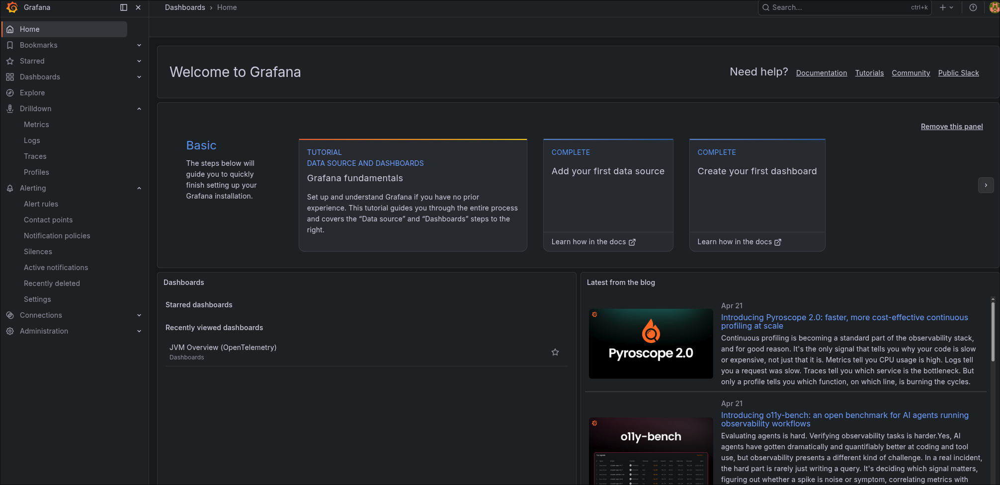

By navigating through the different menu items in the Drilldown menu, you should be able to view logs, traces, and metrics.

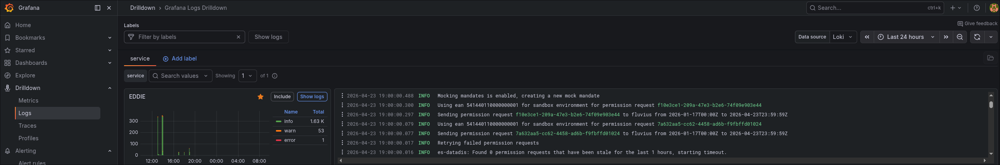

## Step 3 - Include alerting

Observability tools are not very helpful if they do not notify you when things go seriously wrong.
We should therefore include alerting in our Grafana configuration.
[Grafana offers multiple ways to alert users to problems](https://grafana.com/docs/grafana/latest/alerting/fundamentals/notifications/contact-points/).
We are going to use email for alerts.
To do this, we must extend the configuration of the Docker image with the email address Grafana will use to send alert messages.
This will be the sender address; the receiver addresses will be configured later.
For this example, we are using Gmail, but you can use any email provider you prefer.
For Gmail, you must [create an app password](https://support.google.com/mail/answer/185833?hl=en) to allow Grafana to access your email account.

```yml [docker-compose]
services:
# ... other services
  lgtm:
    image: grafana/otel-lgtm:latest
    ports:
      - "3000:3000"
    environment:
      GF_SMTP_ENABLED: "true"
      GF_SMTP_HOST: "smtp.gmail.com:587"
      GF_SMTP_USER: "your-email@gmail.com"
      GF_SMTP_PASSWORD: "your-app-password"
      GF_SMTP_FROM_ADDRESS: "your-email@gmail.com"
      GF_SMTP_FROM_NAME: "Grafana Alerts"
      GF_SMTP_SKIP_VERIFY: "false"
```

Next, we need to set up a contact point in Grafana itself.
Navigate to "Alerting" > "Contact points" and click on "Create contact point". 

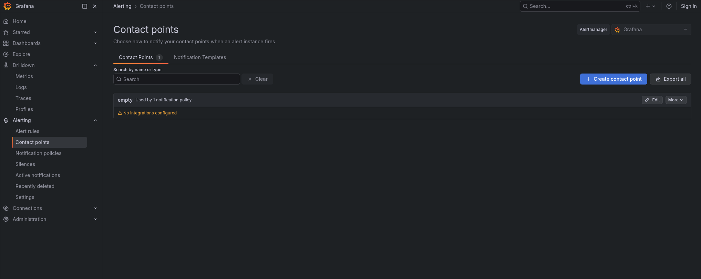

Select "E-Mail" as the integration and enter the email address(es) that should receive alerts in the "Addresses" field.
You can specify multiple addresses; each will receive alert notifications.
Click the "Test" button to have Grafana send a test message to the configured email addresses.
Give the contact point an appropriate name and save it.

> [!IMPORTANT]
> Note that this should not be the same email address used as the sender address.

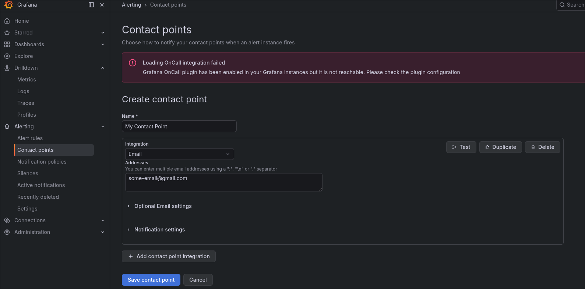

Next, we need to create an [alert rule](https://grafana.com/docs/grafana/latest/alerting/fundamentals/alert-rules/).
Navigate to "Alerting" > "Alert Rules" and click on the "New alert rule" button. 

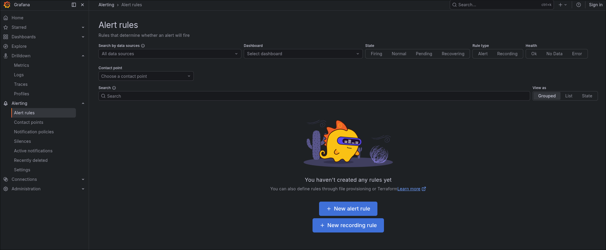

For simplicity, we will create a rule for the simulation connector so that we receive an alert whenever at least one simulation is running.

> [!NOTE]
> Keep in mind that Grafana alert rules expect numeric values. When using Loki as a source, the query should therefore end with a count or count_over_time.

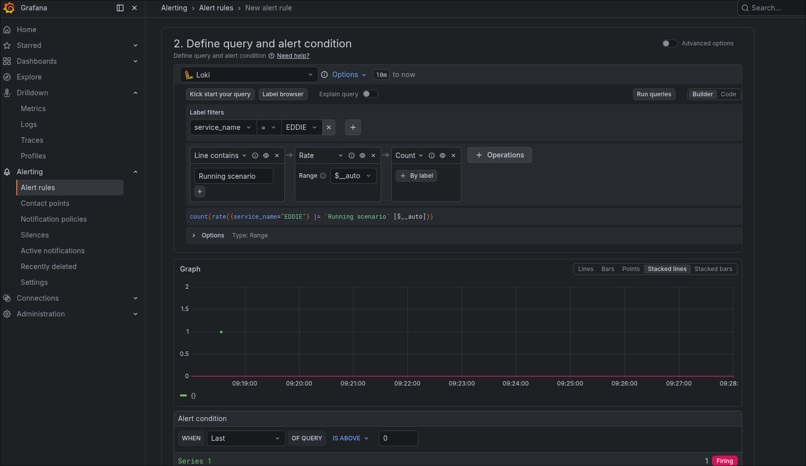
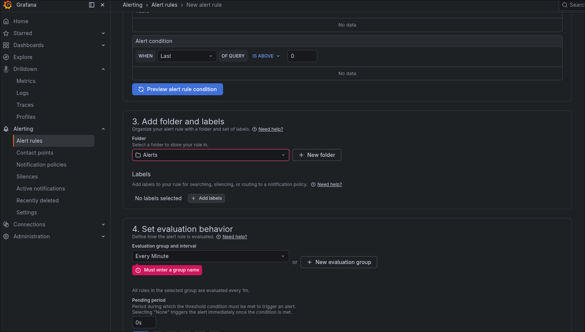

Next, configure the contact point for the alert by selecting the contact point you created earlier.
Then save the alert. 

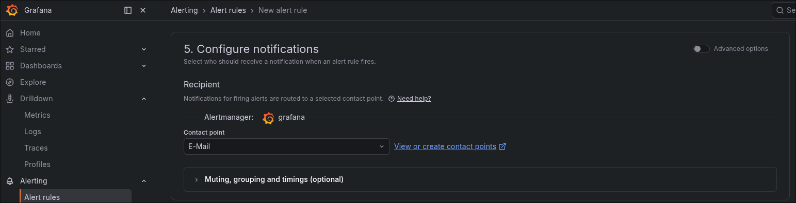
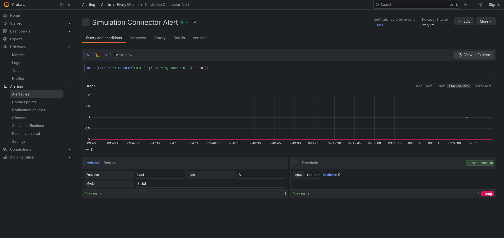

## Step 4 - Trigger the Alert

Finally, trigger the alert by executing one test scenario on the simulation connector. 

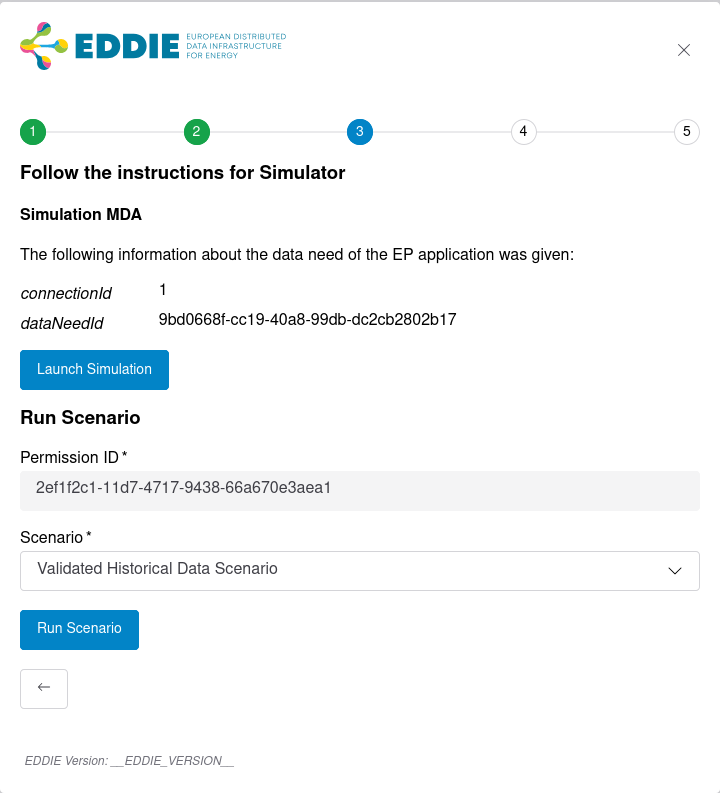

This should trigger the alert, and after about a minute you should receive an email similar to the following: 

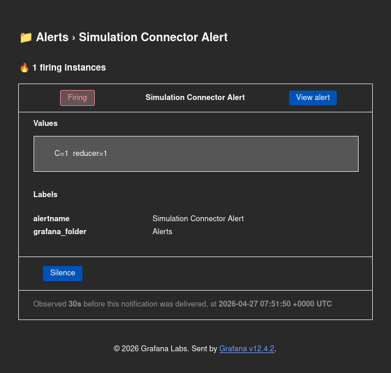

## Checkpoint

- [ ] OpenTelemetry services are running
- [ ] OpenTelemetry and structured logging are enabled in EDDIE
- [ ] A custom alert was created
- [ ] The custom alert was triggered

## What's next

On Day 10, you will include client libraries in your project to serialize and deserialize data coming from and being sent to EDDIE. 

[Download the result of the day](https://github.com/eddie-energy/tutorial/archive/refs/heads/day-09.zip)
