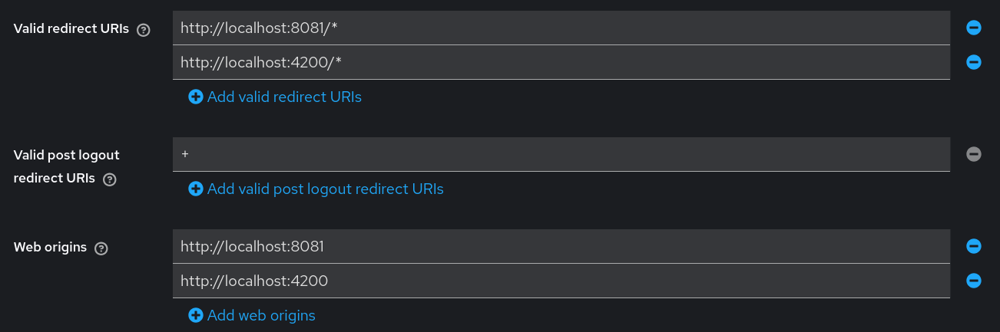
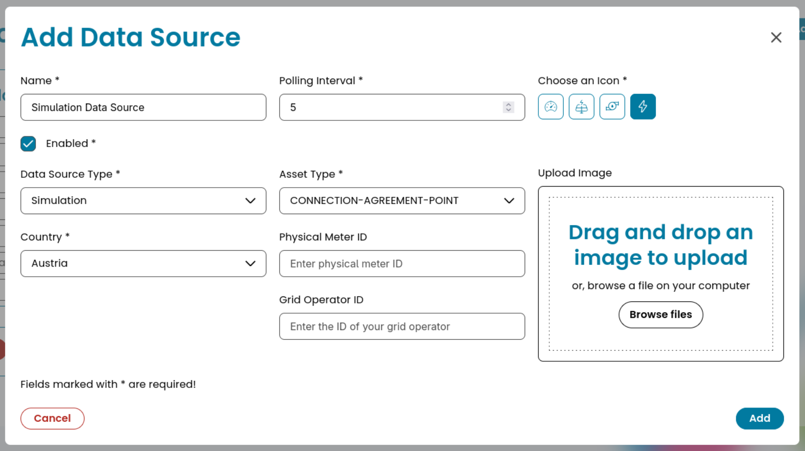
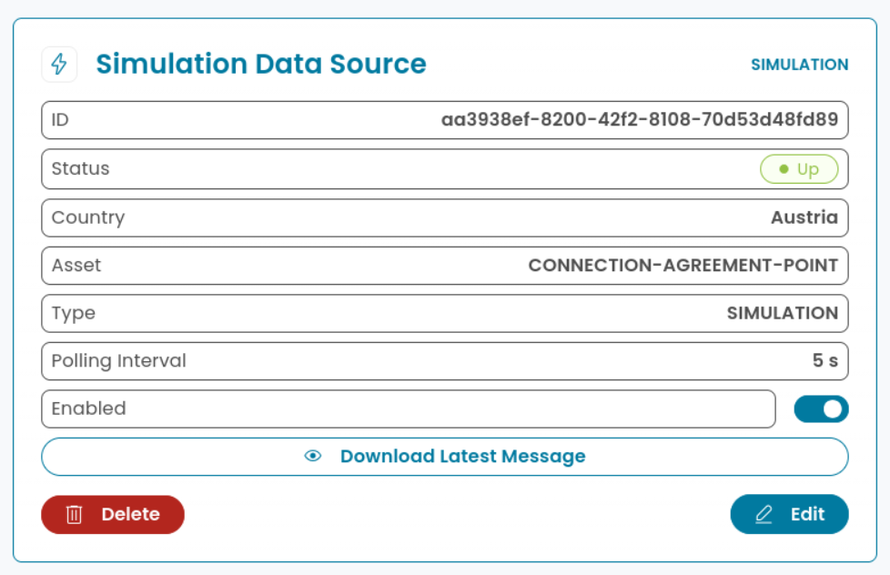
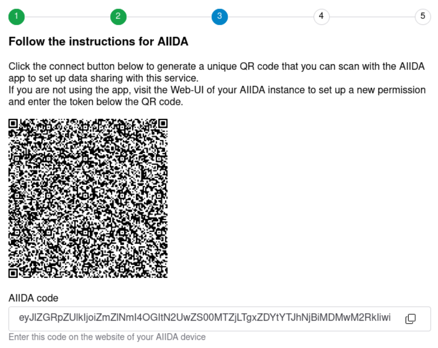
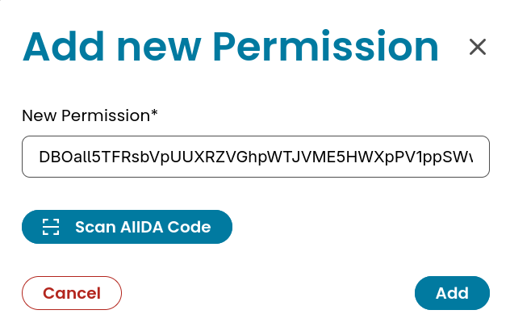
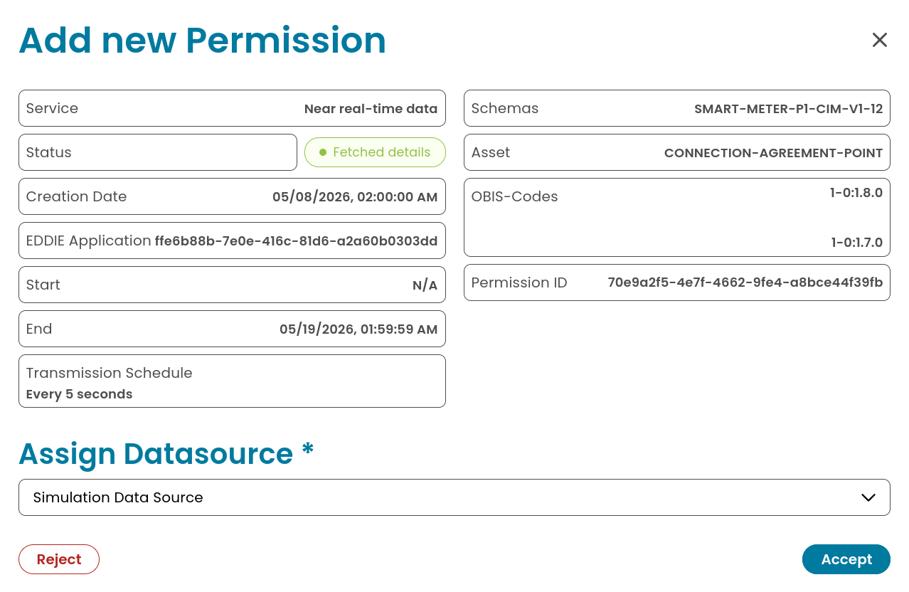
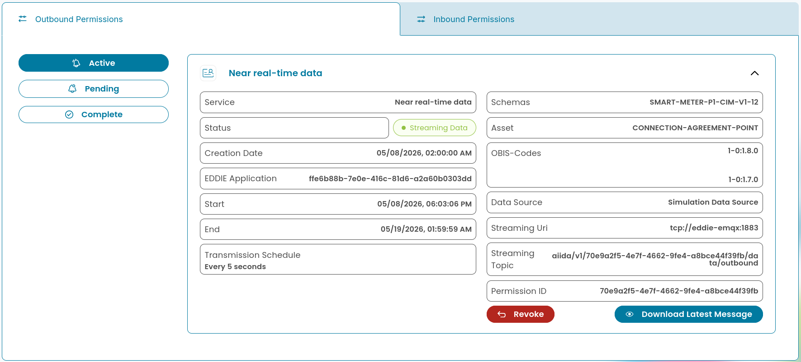

<!--
Goal: Introduce streaming acquisition
Activities:
- Create AIIDA outbound data need
- Explore available real-time connectors
    - Austrian energy adapter
    - Smart gateway adapter
    - Linky
- Understand hosting models (cloud vs on-prem)
Outcome: Real-time acquisition capability
-->

### Day 14 — Real-Time Data via AIIDA

**Goal**:

- Set up an AIIDA cloud instance for your users
- Allow users to connect near real-time data using your AIIDA instance
- Understand AIIDA hosting models and how the communicate with EDDIE

**Estimated time**: 2h

[Download starting code](https://github.com/eddie-energy/tutorial/archive/refs/heads/day-13.zip)

## Step 1 — What is AIIDA?

The Administrative Interface for In-house Data Access (AIIDA) connects to various metering devices such as smart meters and home automation systems,
to stream near real-time energy data and other data to consumers like the EDDIE framework.

While EDDIE and AIIDA are closely related and even share the same repository they are not usually deployed on the same network or server.


For this tutorial we will assume a role in which we operate both the EDDIE framework and an AIIDA cloud instance.

## Step 2 — Running AIIDA

To better differentiate the infrastructure code of our AIIDA instance from our existing EDDIE setup
we will create a new `aiida` folder to place all our AIIDA configuration in.
In this folder, we will create a new `docker-compose.yml` file just for our AIIDA services.

AIIDA needs three things to run: a Timescale database, an MQTT broker, and an authentication service.
We can reuse the same Keycloak instance our application is using.
For the database, the broker, and AIIDA, we will add new services to our `aiida/docker-compose.yml`.

```yaml [aiida/docker-compose.yml
name: eddie-tutorial
services:
```

### Database

AIIDA saves its data to a [Timescale](https://github.com/timescale/timescaledb) database.
Timescale is a PostgreSQL extension specifically designed for time series data.

```yaml [aiida/docker-compose.yml
  aiida-db:
    image: timescale/timescaledb:latest-pg17
    ports:
      - "5433:5432"
    environment:
      POSTGRES_USER: aiida
      POSTGRES_PASSWORD: aiida
      POSTGRES_DB: aiida
    volumes:
      - ./db.sql:/docker-entrypoint-initdb.d/db.sql:ro
    restart: always
    healthcheck:
      test: [ "CMD-SHELL", "pg_isready -U aiida" ]
      interval: 10s
      timeout: 3s
      retries: 3
```

We will create a separate user with limited privileges for our message broker to store authentication information.
You can find more information on this setup in our [AIIDA documentation](https://architecture.eddie.energy/aiida/1-running/database.html#emqx-user).
For this tutorial, we will simply add a new user in the `aiida/db.sql` file that we mount as a volume in our services.

```sql [aiida/db.sql]
CREATE USER emqx WITH ENCRYPTED PASSWORD 'aiida';
```

### MQTT Broker

```yaml [aiida/docker-compose.yml]
  aiida-emqx:
    image: emqx/emqx:5.8.6
    depends_on:
      aiida-db:
        condition: service_healthy
    ports:
      - "1884:1883"
      - "8884:8883"
      - "18084:18083"
    environment:
      EMQX_AUTHENTICATION__1__DATABASE: aiida
      EMQX_AUTHENTICATION__1__SERVER: aiida-db:5432
      EMQX_AUTHENTICATION__1__PASSWORD: aiida
      EMQX_AUTHORIZATION__SOURCES__1__DATABASE: aiida
      EMQX_AUTHORIZATION__SOURCES__1__SERVER: aiida-db:5432
      EMQX_AUTHORIZATION__SOURCES__1__PASSWORD: aiida
    restart: always
    volumes:
      - ./emqx.hocon:/opt/emqx/etc/base.hocon:ro
      - ./init-user.json:/opt/emqx/data/init-user.json:ro
    healthcheck:
      test: [ "CMD", "/opt/emqx/bin/emqx", "ctl", "status" ]
      interval: 5s
      timeout: 25s
      retries: 5
```

Download from the EDDIE repository into your aiida folder:

- [emqx.hacon](https://github.com/eddie-energy/eddie/blob/main/aiida/docker/emqx/emqx.hocon)
- [init-user.json](https://github.com/eddie-energy/eddie/blob/main/aiida/docker/emqx/init-user.json)

Adjust the password inside the `init-user.json` file to `aiida`

```json [aiida/init-user.json]
[
  {
    "user_id": "aiida",
    "password": "aiida",
    "is_superuser": true
  }
]
```

For detailed information on how to set up an EMQX broker in production,
you may again refer to the [AIIDA documentation](https://architecture.eddie.energy/aiida/1-running/emqx.html).

### AIIDA

With its dependencies set up we now define AIIDA container.

```yaml [aiida/docker-compose.yml]
  aiida:
    image: ghcr.io/eddie-energy/aiida:latest
    depends_on:
      aiida-db:
        condition: service_healthy
      aiida-emqx:
        condition: service_healthy
    env_file:
      - .env
    ports:
      - "8081:8080"
```

Similar to our EDDIE instance, we will keep a separate `aiida/.env` file for its configuration.

```shell
AIIDA_EXTERNAL_HOST=http://localhost:8081

SPRING_DATASOURCE_URL=jdbc:postgresql://aiida-db:5432/aiida
SPRING_DATASOURCE_USERNAME=aiida
SPRING_DATASOURCE_PASSWORD=aiida

MQTT_INTERNAL_HOST=tcp://aiida-emqx:1883
MQTT_EXTERNAL_HOST=tcp://localhost:1884
MQTT_PASSWORD=aiida

KEYCLOAK_INTERNAL_HOST=http://keycloak:8080
KEYCLOAK_EXTERNAL_HOST=http://localhost:8888
KEYCLOAK_REALM=tutorial-realm
KEYCLOAK_CLIENT=tutorial-client
```

### Keycloak

We also need to adapt our Keycloak realm to allow the AIIDA UI at http://localhost:8081 as origin and for redirects.
This can be done via the [Keycloak UI](http://localhost:8888/admin/master/console/#/tutorial-realm/clients) or by adjusting our configuration.

```json [keycloak.json]
{
  "realm": "tutorial-realm",
  "clients": [
    {
      "redirectUris": [
        "http://localhost:4200/*",
        "http://localhost:8081/*"
      ],
      "webOrigins": [
        "http://localhost:4200",
        "http://localhost:8081"
      ],
      ...
```



### Include compose file

Finally, we will include our `aiida/docker-compose.yml` in our root `docker-compose.yml`.
That way we can have EDDIE and AIIDA in the same network and manage them from the same compose environment.

```yaml [docker-compose.yml]
name: eddie-tutorial
include:
  - aiida/docker-compose.yml
services:
  ...
```

Before we continue with the EDDIE connection, we will check our AIIDA setup in isolation.
For this you will need to start Keycloak in addition to our AIIDA services:

```shell
docker compose up -d keycloak aiida-db aiida-emqx aiida
```

Once all containers are running visit http://localhost:8081/ for the AIIDA UI.

## Step 3 — Adding AIIDA data sources

Before we can exchange any data, we need to connect a measuring device.
AIIDA supports various devices as "Data Sources".
For this tutorial, we will again use a simulation data source to generate test data.
We will however explore some actual real-time connectors to showcase AIIDA capabilities.

Navigate to the **Data Sources** view at http://localhost:8081/data-sources and click the **Add Data Source** button.
We will use the **CONNECTION-AGREEMENT-POINT** asset type as we will request this type later.
We enter a polling interval of 5 seconds, choose our country, and leave the optional fields unset.



Upon clicking the **Add** button, the data source should show up in the UI.
The status will be inferred on page load once the first message has been generated.



## Step 4 — Connecting AIIDA and EDDIE

In EDDIE, AIIDA instances are connected by an AIIDA region connector.

The AIIDA region connector also requires an MQTT broker, 
so we will add one to our root `docker-compose.yml`.

```yaml [docker-compose.yml]
  eddie-emqx:
    image: emqx/emqx:5.8.6
    ports:
      - "1883:1883"
      - "8883:8883"
      - "18083:18083"
    environment:
      EMQX_AUTHENTICATION__1__DATABASE: eddie
      EMQX_AUTHENTICATION__1__SERVER: db:5432
      EMQX_AUTHENTICATION__1__PASSWORD: eddie
      EMQX_AUTHORIZATION__SOURCES__1__DATABASE: eddie
      EMQX_AUTHORIZATION__SOURCES__1__SERVER: db:5432
      EMQX_AUTHORIZATION__SOURCES__1__PASSWORD: eddie
    volumes:
      - ./emqx.hocon:/opt/emqx/etc/base.hocon:ro
      - ./init-user.json:/opt/emqx/data/init-user.json:ro
```

Similar to AIIDA's MQTT broker, EDDIE's instance also adds some configuration for authentication.
You can again download the configuration files from the EDDIE repository and place them in the root folder.

- [emqx.hocon](https://github.com/eddie-energy/eddie/blob/main/env/emqx/emqx.hocon)
- [init-user.json](https://github.com/eddie-energy/eddie/blob/main/env/emqx/init-user.json)

For the `init-user.json` we again adjust the password:

```json [init-user.json]
[
  {
    "user_id": "eddie",
    "password": "eddie",
    "is_superuser": true
  }
]
```

Now in the EDDIE database, we also want to add a new `emqx` user with limited access.
In our root `db.sql` file we will add one line of SQL.
If you want to keep your existing data you can just run the SQL on the database.

```sql [db.sql]
CREATE USER emqx WITH ENCRYPTED PASSWORD 'eddie';
```

The region connector itself is configured via environment variables.
Inside EDDIE's `.env` file in the root folder:

```dotenv [.env]
REGION_CONNECTOR_AIIDA_ENABLED=true
REGION_CONNECTOR_AIIDA_CUSTOMER_ID=tutorial
REGION_CONNECTOR_AIIDA_BCRYPT_STRENGTH=10
REGION_CONNECTOR_AIIDA_MQTT_SERVER_URI=tcp://eddie-emqx:1883
REGION_CONNECTOR_AIIDA_MQTT_USERNAME=eddie
REGION_CONNECTOR_AIIDA_MQTT_PASSWORD=eddie
```

A full list of configuration options and instructions for production deployments are found in the [EDDIE framework documentation](https://architecture.eddie.energy/framework/1-running/region-connectors/region-connector-aiida.html).

A common pitfall in local setups is that AIIDA will not be able to reach EDDIE via localhost.

```yaml [aiida/docker-compose.yml]
services:
  aiida:
    extra_hosts:
      - "localhost:host-gateway"
```

To request near real-time data in the EDDIE framework you also need a new type of data need.
There are two types of data needs for AIIDA:
- `aiida-outbound` specifies that AIIDA should _send_ data produced by the customer.
- `aiida-inbound` specifies that AIIDA will _receive_ data from your EDDIE instance.

For now, we will focus on the `aiida-outbound` data need to request near real-time data for our application.
On day 16, we will explore how the `aiida-inbound` data need can be used for sending commands to interact with IoT devices.

In our `data-needs.json` we will add a new block for the AIIDA data need:

```json
{
  "type": "outbound-aiida",
  "id": "00000000-0000-0000-0000-000000000004",
  "name": "Near real-time data",
  "description": "Near real-time consumption data from the smart meter",
  "purpose": "purpose",
  "policyLink": "https://example.com/privacy",
  "duration": {
    "type": "relativeDuration",
    "start": "P0D",
    "end": "P10D"
  },
  "transmissionSchedule": "*/5 * * * * *",
  "acknowledgementRequired": false,
  "schemas": [
    "SMART-METER-P1-RAW",
    "SMART-METER-P1-CIM-V1-12"
  ],
  "asset": "CONNECTION-AGREEMENT-POINT",
  "dataTags": []
}
```

Let's take a look at its fields.
- `duration` can again be an absolute duration ending with a specific date or a relative duration.
- `transmissionSchedule` is a [Cron expression](https://docs.oracle.com/cd/E12058_01/doc/doc.1014/e12030/cron_expressions.htm) of 6 fields.
  Positions represent second, minute, hour, day of month, month, and day of week.
  Our `*/5 * * * * *` would be interpreted as a transmission schedule of every 5 seconds.
- `acknowledgementRequired` indicates that the recipient should send an acknowledgement document when they receive data.
  This will become relevant for us when we want to confirm that a user device has received an instruction on day 16.
- `schemas` specifies in which format our data should be sent to the outbound connectors.
  We will request both [raw](https://architecture.eddie.energy/aiida/1-running/schemas/raw/raw.html) and [CIM](https://architecture.eddie.energy/aiida/1-running/schemas/cim/cim.html) formats,
  although one format would suffice for our application.
- `asset` defines which type of physical or logical asset is represented by a data source.
  For our scenario we are looking for the total consumption of a user household,
  which we assume will be provided by a connection agreement point.
- `dataTags` can be used to request specific data points or specific formats from a smart meter in the form of obis codes.
  We will not be using them here.

Comprehensive documentation for AIIDA data needs can be found [here](https://architecture.eddie.energy/aiida/1-running/data-need.html).

With AIIDA, its region connector, and the data need set up, 
we can finally try a full flow of requesting and receiving AIIDA near real-time data!

## Requesting and receiving near real-time data

With all our infrastructure in place, we can now start all containers in our environment.
You might want to shut down all existing containers in advance to reload their configuration.

```shell
docker compose down
docker compose up -d
```

For our first connection, we will use the demo button at http://localhost:8080 instead of our own application.

In the list of data needs select the newly created **Near real-time data** entry and click the EDDIE button.
Instead of asking for a country, the EDDIE dialogue will automatically select the AIIDA region connector.
The region connector UI generates an AIIDA code to connect an AIIDA instance.



Now in the AIIDA UI at http://localhost:8081 click the **Add Permissions** button and enter the AIIDA code.



A dialogue will show the specifics of the permission request and ask you to assign a data source.
We will choose our **Simulation Data Source** here.



Once accepted you should see a new active permission card that can be expanded for details.




<!-- TODO: Check why AIIDA raw data does not end up on the raw data messages endpoint -->

Finally, the most important part is if the data actually ends up in our outbound connectors.
Unlike historical data, AIIDA data is not made available as raw data, but in a separate topic.
Fetching the near real-time data topic from the REST outbound connector,
you should see a bunch of messages generated by the AIIDA region connector.

```shell
curl http://localhost:9090/outbound-connectors/rest/cim_1_12/near-real-time-data-md | jq
```

## Checkpoint

- `docker compose up -d` runs all containers without errors
- The AIIDA UI is accessible on http://localhost:8081
- Permissions created from the EDDIE button can be added in the AIIDA UI
- Data generated by the simulation data source shows up in the outbound connectors

## What's next

On day 15 we will use the incoming data in our application to show a user's near real-time data provided by AIIDA
together with their validated historical data.

[Download the result of the day](https://github.com/eddie-energy/tutorial/archive/refs/heads/day-14.zip)